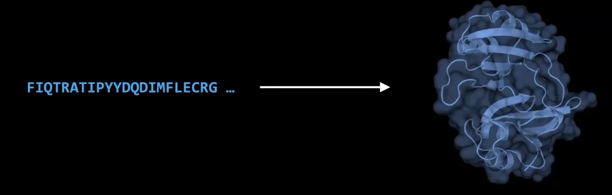
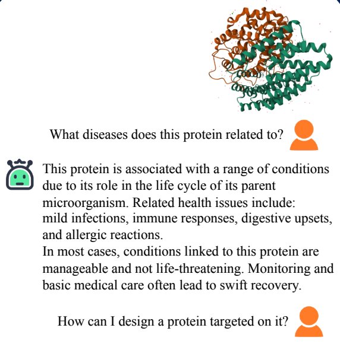
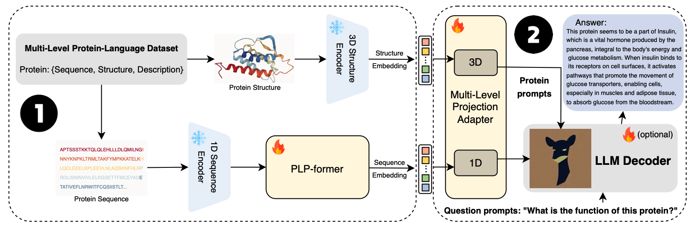

# ProteinLearn

ProteinLearn makes complex protein data understandable for diverse user groups, including students, drug designers, and researchers.

## Motivation

- [AlphaFold](https://www.nature.com/articles/s41586-021-03819-2), [ESM](https://www.biorxiv.org/content/10.1101/2022.07.20.500902v1.full.pdf), and other protein LLMs have made significant progress in predicting 3D structures given amino acid sequences. However, they are unable to provide human-understandable language to further explain the functionality of the protein.

- [ProteinChat](https://openreview.net/pdf/6344e8a42ab8c7aa6806cf146c527406cee1b786.pdf) has been proposed to help us understand protein structures through natural language. However, it still suffers from hallucination when encountering proteins not included in the training dataset.

- This problem can be circumvented by introducing hallucination-free LLMs from the [`Hallucinations Leaderboard`](https://huggingface.co/spaces/hallucinations-leaderboard/leaderboard) or by using a RAG system.

## Overview

- Amino acid squences together with the proteins' 3D structure are encoded together to provide comprehensive information. 
- The adapter is trained to form soft prompt as input for the downstream LLMs to generate explanation

## Time Line (Weeks)

- (0) Project discovery
- (1) Explore protein data sources for evaluation and RAG
- (2-4) Reseach and design ProteinLearn pipeline
- (5-6) Experiment LLMs on [`Hallucinations Leaderboard`](https://huggingface.co/spaces/hallucinations-leaderboard/leaderboard) 
- (6-7) Experiment RAG with external protein data sources
- (8) Build user interface and 3D protein visualization
- (9) Ensure CI/CD is robust and dockerizes
- (10) Documentation and Clean up
